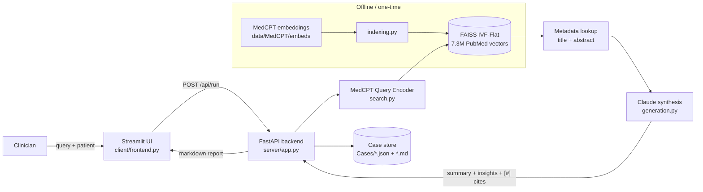

# ContextMD

**Semantic PubMed retrieval + LLM synthesis for clinical case briefings — a full-stack RAG system with a rigorous evaluation suite.**


> Built as a hackathon project: an end-to-end retrieval-augmented pipeline that turns a clinical question + patient profile into an evidence-grounded, citation-backed briefing over 7.3M PubMed abstracts.

## Overview

Clinicians researching a case must sift through thousands of PubMed abstracts to find the few that matter. ContextMD does the retrieval and first-pass synthesis: it embeds the clinical question with a **biomedical** encoder (MedCPT), runs approximate nearest-neighbor search over a **7.3M-vector FAISS index**, and asks Claude to summarize the top abstracts into a structured briefing with numbered citations. The interesting parts are engineering the retrieval to be both accurate and fast on commodity hardware (a 21 GB index memory-mapped on a 24 GB machine), and building a **multi-method evaluation suite** that measures retrieval quality, generation faithfulness, citation accuracy, and safety-guardrail compliance — not just vibes.

## Key Features

- **Biomedical semantic search** — MedCPT query encoder + FAISS IVF-Flat over 7.3M PubMed abstract vectors (768-d, cosine via inner product).
- **Grounded LLM synthesis** — Claude generates a Summary + Insights with `[#]` citations, constrained by prompt to avoid diagnosis/advice.
- **One-shot orchestration** — a single `POST /api/run` embeds, retrieves, dedupes, generates, and persists a timestamped case bundle.
- **Tuned approximate search** — `nprobe` sweep shows production settings recover **98% of exact recall at 41 ms/query**; index is mmap'd to run in < RAM.
- **5-method evaluation suite** — ANN recall vs. exact, pooled gold-set IR metrics, Ragas, ALCE-style citation checks, and LLM-judged safety guardrails.
- **Full-stack** — FastAPI backend + Streamlit clinical UI + reproducible case persistence (JSON + Markdown).

## Architecture



**Data flow:** the frontend sends the question + patient fields to `/api/run`. The backend embeds the query (MedCPT), searches FAISS (`nprobe=32`, top-20), dedupes and attaches PubMed metadata, keeps the top-5 abstracts, and prompts Claude for a cited briefing. The index itself is built offline by `indexing.py` from precomputed MedCPT embedding chunks.

## Tech Stack

- **Core:** Python 3.11, FastAPI, Uvicorn, Pydantic, Streamlit
- **Retrieval / ML:** FAISS (IVF-Flat), MedCPT (`ncbi/MedCPT-Query-Encoder`), PyTorch, Transformers, sentence-transformers, NumPy
- **LLM:** Anthropic Claude (generation + judging)
- **Evaluation:** Ragas, custom IR metrics, LLM-as-judge (OpenAI + Claude)
- **Data:** PubMed abstracts (MedCPT embeddings), orjson

## Results

Measured this repo's actual pipeline; see [`eval/`](eval/) for the scripts and per-run reports.

| Stage | Metric | Score | Method |
|---|---|---|---|
| Retrieval | Recall@5 vs. exact (`nprobe=32`) | **0.98** @ 41 ms | ANN sweep, exact scan as ground truth |
| Retrieval | Recall@20 / MRR | **0.72 / 0.52** | Pooled, Claude-labeled gold set |
| Generation | Faithfulness / Answer relevancy | **0.84 / 0.86** | Ragas (LLM judge) |
| Generation | Citation precision / recall | **0.82 / 0.67** | ALCE-style, Claude judge |
| Safety | Guardrail compliance | **100%** | AspectCritique: no diagnosis/advice, cites sources |

<sub>Samples: 12 queries (retrieval), 1 case (Ragas), 44 reports (citations), 12 reports (safety). Raising `nprobe` 32→64 yields lossless (100%) recall for ~36 ms more.</sub>

## Getting Started

### Prerequisites
- Conda (recommended) and Python 3.11
- An Anthropic API key ([console](https://console.anthropic.com/))
- MedCPT PubMed embedding chunks in `data/MedCPT/{embeds,pmids,pubmed}/` — see [`Setup.md`](Setup.md)

### Installation
```bash
git clone https://github.com/JackNapier20/ContextMD.git
cd ContextMD
conda env create -f environment.yml   # creates the 'MedicoRAG' env
conda activate MedicoRAG
```

### Configuration
```bash
cp .env.example .env
# edit .env and set ANTHROPIC_API_KEY (OPENAI_API_KEY only needed for evals)
```

### Build the index (one-time)
```bash
python downloadMedCPT.py   # cache the MedCPT query encoder
python indexing.py         # build output/pubmed_ivfpq.faiss from embeddings
```

### Run
```bash
# Terminal 1 — backend
uvicorn server.app:app --host 0.0.0.0 --port 8000 --reload

# Terminal 2 — frontend
streamlit run client/frontend.py       # opens http://localhost:8501
```

### CLI (no server)
```bash
python search.py "preoperative cardiac risk in elderly patients" --show_metadata
python createCase.py "EGFR-mutant NSCLC first-line therapy" --patient "age=58 sex=female"
python generation.py                    # generate a Claude briefing for the latest case
```

### Evaluation (optional)
```bash
python -m pip install -r eval/requirements.txt
python eval/eval_retrieval_faiss.py     # ANN recall vs exact, nprobe sweep (no API key)
python ragas_eval.py                    # generation faithfulness/relevancy (needs OPENAI_API_KEY)
python eval/eval_citations.py           # citation precision/recall (needs ANTHROPIC_API_KEY)
```

## Project Structure

```
ContextMD/
├── server/app.py         # FastAPI backend: /api/search, /api/cases, /api/generate, /api/run
├── server/settings.py    # Pydantic settings (paths, nprobe, model, keys)
├── client/frontend.py    # Streamlit clinical UI
├── indexing.py           # Build FAISS IVF-Flat index from MedCPT embeddings
├── search.py             # MedCPT query embedding + FAISS search + metadata lookup
├── generation.py         # Prompt assembly + Claude call + Markdown report
├── createCase.py         # CLI: search -> save case bundle (JSON + prompt)
├── downloadMedCPT.py     # Cache the MedCPT query encoder locally
├── ragas_eval.py         # Generation eval (Ragas)
├── eval/                 # Evaluation suite (retrieval, IR, citations, safety) + results/
├── environment.yml       # Conda env (MedicoRAG, Python 3.11)
├── data/MedCPT/          # embeds/ pmids/ pubmed/ (chunks 30–37; not committed)
└── output/               # Built FAISS index + inverted lists
```

## Roadmap

- **Model configurability** — `generation.py` pins a retired Claude model ID; move it to `settings.py` and default to a current model.
- **Stronger benchmark** — expand the 8-query gold set and add reference answers to unlock answer-correctness metrics.
- **Full corpus + compression** — index all PubMed (currently chunks 30–37) and add IVF-PQ to shrink the 21 GB index.
- **Deployment** — containerize (Docker) and stand up a hosted demo.

## License

Released under the [MIT License](LICENSE).

---

> **Disclaimer:** ContextMD is a research/productivity prototype. It does **not** provide medical advice or diagnosis and is not a substitute for clinical judgment. All outputs should be verified against the cited PubMed sources by a qualified professional.
